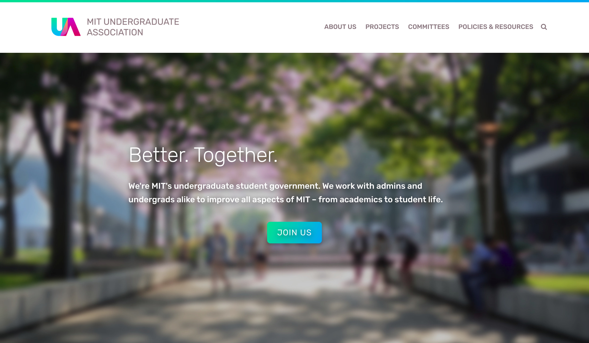
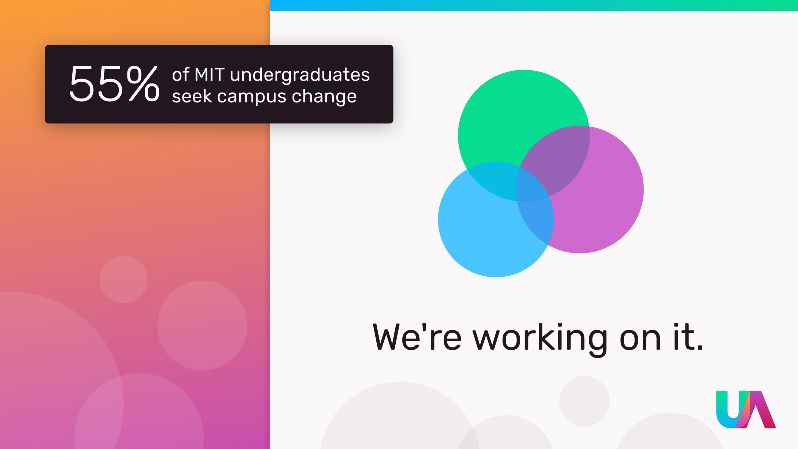
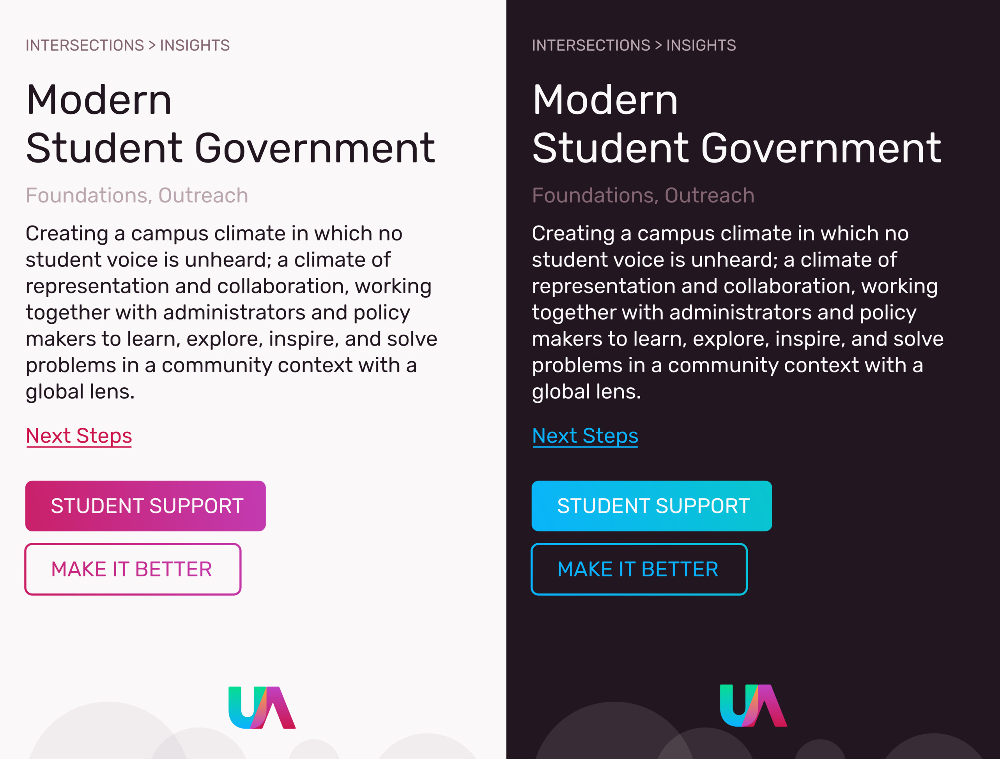
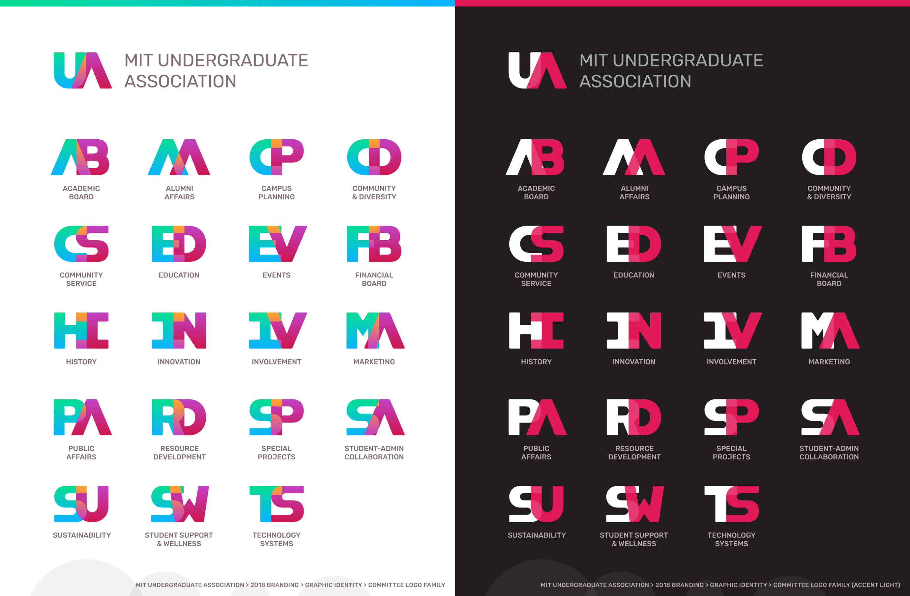
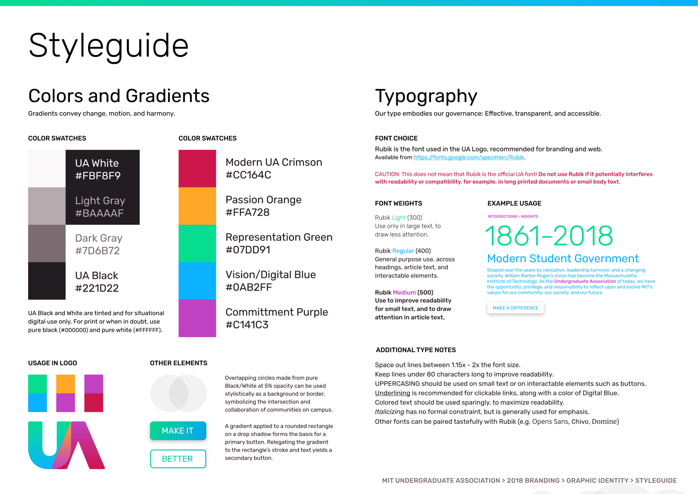
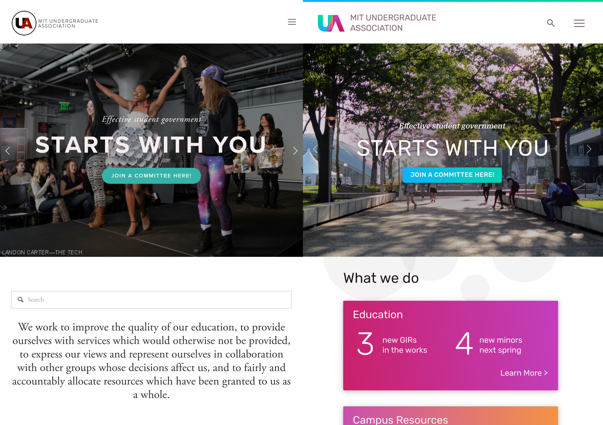
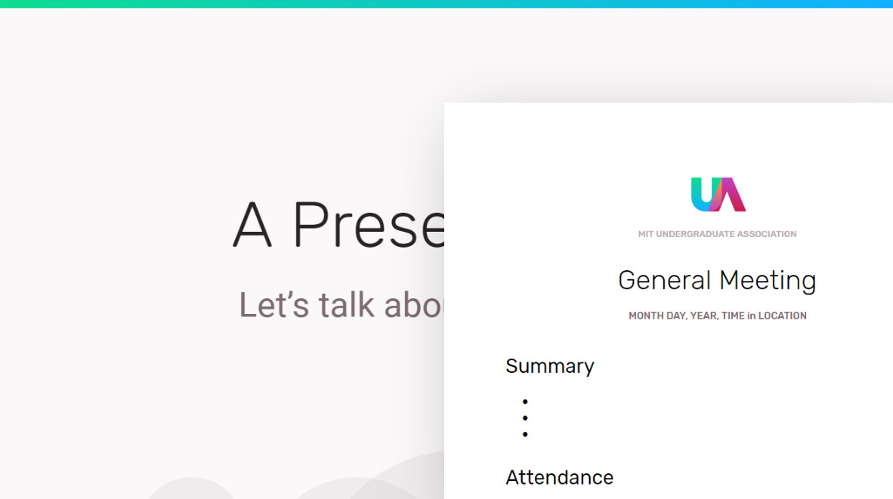
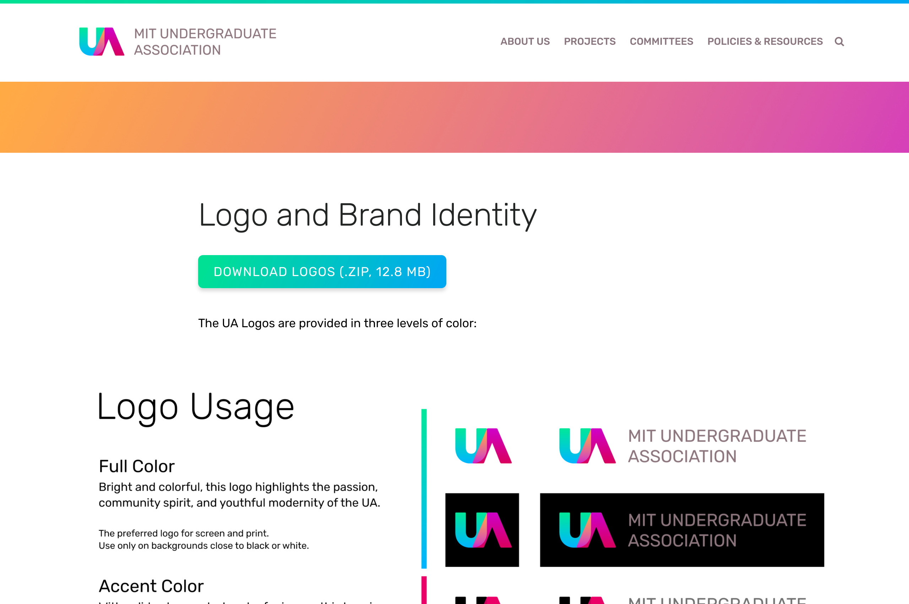
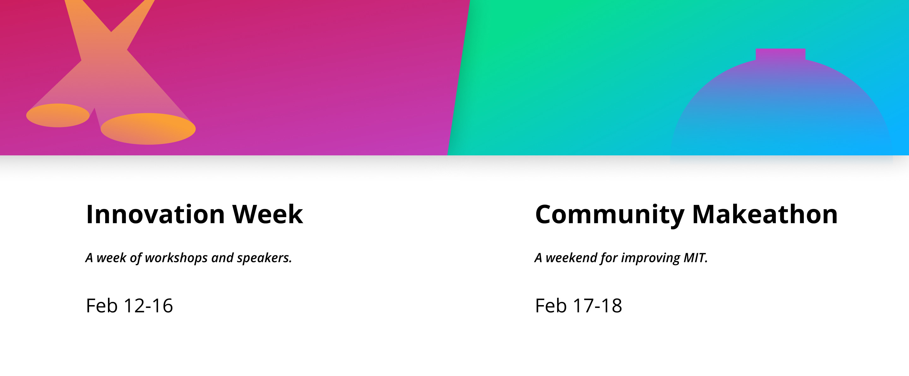

# UA Rebranding

Since my first semester at MIT, I've been part of MIT's student government: the MIT Undergraduate Association, or UA. Three years later, having pushed for a better MIT through community-driven [makeathons](https://thetech.com/2018/02/22/innovation-week) and forward-thinking [study spaces](https://thetech.com/2018/04/13/26-110-study-space), I turned my attention towards improving the UA itself:  modernizing the organization's graphic identity across print and web to better represent next generation of 200-strong youthful and passionate student policymakers and changemakers.

[Visit the Website](http://ua.mit.edu/)

It began with a napkin sketch and an idea. A round U and sharp A, overlapping like a Venn diagram. In the middle sits an oblong sail-shaped sliver: the interface between the Undergraduates and Administrators, Students and Faculty, the collaboration between the young, energetic, passionate and full of ideas, and the experienced with the power to enact change. The UA is that intersection: the group of students who represent and connect the 4,000 plus undergraduates to the administrators who run the school.

When I sat down at the computer to put these ideas on pixels, "what is" became "what if". What if governance could be swift, responsive, dynamic, transparent, accessible, and modern? What if student government could be reinvented today, in a world of emails, messages, and interactive webpages? What would that look like?

*Poster Design Mockup*

*Mobile UI Mockups in Light and Dark*

*The UA consists of 19 distinct committees, each with a different focus.*

Bright colors, rounded corners, concise and approachable prose. It was never just a logo; It was an ideology, a concept, a set of values that would give way to a design system, a family of logos, a styleguide. In a computational mindset, it could be seen as a recipe, a process, a procedure for creating anything "UA".

I designed the visual assets in Figma with procedurality in mind, making extensive use of Figma's modern toolset of linked components, local styles, and non-destructive boolean operations. I ended up with a design document that not only simplified the creation of, say, twenty different logos, but also allowed the logos to be edited easily afterwards: changes to one label or letterform would automatically update all others.

<video src="UARebrandProceduralVid.mp4" autoplay muted loop></video>
*A procedural design document in action.*

*A work-in-progress styleguide mockup.*

*Previous Website vs Redesign Mockup*

Once the assets were designed and finalized, I began rolling out the branding across the organization. I worked with UA members Anjali and Clare to create branded templates for Google Docs and Slides across multiple occasions -- from casual meeting summaries to formal presentations. I also overhauled their Squarespace website with custom CSS trickery, breaking out of Squarespace template without breaking the WYSIWYG editor. I then tested and tweaked the CSS to improve readability while preserving backwards compatibility with the numerous pages and documents uploaded to the site over the years.

If I've done my job well, the styleguide, website, templates, and procedural design document should stand for at least a few years, open and adaptable by future designers before it eventually gets replaced. There's a saying along the lines of "design should be transparent", thinking that design should be intuitive, natural, and fitting to the point that it fades into the cultural background. But for me, design shouldn't just represent the zeitgeist. Design should question, reinvent, and advance it.

*Branding materials are available to download for the MIT community.*

*Potential UA-Led Events Mockup*

*DISCLAIMER: Text in mockups are intended as placeholders only and may not be indicative of the views, opinions, or beliefs of MIT or the UA.*

---

Collaborators: Anjali Nambrath, Clare Liu

Special Thanks: Alexa Martin, Kat Jiang, UA Marketing, MIT Undergraduate Association

Learning Focus: Procedural Design, Value-driven Design, Graphic Identity and Branding, Working with Organizations, Custom Squarespace CSS

Media: Graphic Identity, Logo, Logo Family, Graphic Design, Design Document, Website

Software: [Figma](https://figma.com), [Inkscape](https://inkscape.org/en/), [Squarespace](https://www.squarespace.com/), CSS

Release Date: May 2018

